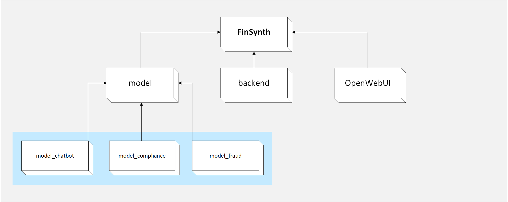

# FinSynth



[英文文档](./docs/README.en.md)

## 项目介绍

基于Open WebUI框架实现的大模型交互平台，大模型后端由本团队微调并编写。

本项目内部代码并不需要太多二次改进，若想用此制作属于自己的交互平台前端请参照[Open WebUI](https://docs.openwebui.com/)官网，大模型参考我们的[Hugging Face](https://huggingface.co/)

本大模型有三个，分别解决三个领域的问题：

- 客户服务聊天机器人：生成可以有效理解和回应广泛客户询问的训练数据。
- 欺诈检测：从交易数据中提取模式和异常，以训练可以识别和预防欺诈行为的模型。
- 合规监控：总结法规和合规文件，以帮助模型确保遵守金融法规。

## 运行方式

***第一次运行请耐心等待，会去拉取很多文件，如果终端没有报错就是没有问题，全部运行完毕后刷新网页使用即可***

```powershell
git clone https://github.com/Fintech-Dreamer/FinSynth.git
cd FinSynth
```

### 快速运行

请自行下载docker并且换源（防止无法拉取镜像）

```powershell
docker-compose up --build
```

打开网站`http://localhost:5173/`

### 前后端分离运行

请先自行安装[NVM](https://nvm.p6p.net/)和[Anaconda](https://www.anaconda.com/download)

一共需要开启五个终端前端(FinSynth文件夹)

终端1

```powershell
nvm install 22.13.0
nvm use 22.13.0
npm install
npm run dev
```

#### 后端(backend文件夹)

终端2

```powershell
conda create -n FinSynth python=3.11
conda activate FinSynth
```

```powershell
cd backend
pip install -r requirements.txt -U
uvicorn open_webui.main:app --host 0.0.0.0 --port 8080 --reload
```

#### 大模型(model文件夹)

终端3

```powershell
cd model
conda activate FinSynth
pip install -r requirements.txt -U
uvicorn model_chatbot:app --host 0.0.0.0 --port 8000 --reload
```

终端4

```powershell
cd model
conda activate FinSynth
uvicorn model_fraud:app --host 0.0.0.0 --port 8001 --reload
```

终端5

```powershell
cd model
conda activate FinSynth
uvicorn model_compliance:app --host 0.0.0.0 --port 8002 --reload
```

## 其他

### 微调模型

[聊天机器人](https://huggingface.co/Fintech-Dreamer/FinSynth_model_chatbot)

[欺诈检测](https://huggingface.co/Fintech-Dreamer/FinSynth_model_fraud)

[合规监控](https://huggingface.co/Fintech-Dreamer/FinSynth_model_compliance)

### 微调数据集

[Dataset ](https://huggingface.co/datasets/Fintech-Dreamer/FinSynth_data)

## 技术细节

### 前端和后端

使用Open WebUI框架实现的大模型交互平台

### 大模型

大模型从微调到编写后端这部分完全是自己编写的

- 后端用python fastapi编写
- 实现了流式输出：用流式输出的方式调用大模型API，能够实时返回中间结果，减少用户的阅读等待时间，并降低请求的超时风险。
