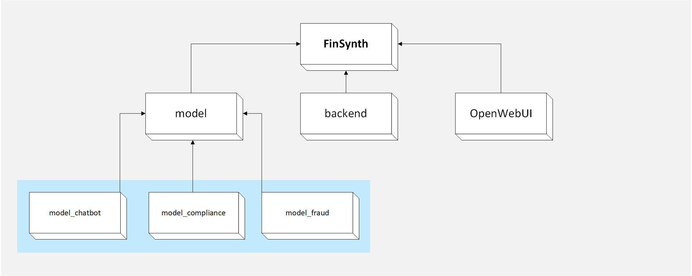

# FinSynth



## Project Introduction

A large language model interaction platform implemented based on the Open WebUI framework, with the backend models fine-tuned and developed by our team.

The internal code of this project requires minimal secondary modifications. To create your own interaction platform frontend, please refer to the official [Open WebUI documentation](https://docs.openwebui.com/). For model details, visit our [Hugging Face](https://huggingface.co/) page.

This system contains three specialized models addressing distinct domains:

1. **Customer Service Chatbot**
   Generates training data to effectively understand and respond to diverse customer inquiries.
2. **Fraud Detection**
   Extracts patterns and anomalies from transaction data to train models for identifying and preventing fraudulent activities.
3. **Compliance Monitoring**
   Summarizes regulatory documents and compliance materials to help models ensure adherence to financial regulations.

## Execution Instructions

First, install [NVM](https://nvm.p6p.net/) and [Anaconda](https://www.anaconda.com/download) independently.

You will need to launch **five terminal sessions** in total.

```powershell
git clone https://github.com/Fintech-Dreamer/FinSynth.git
cd FinSynth
```

### Frontend (FinSynth Directory)

**Terminal 1**

```powershell
nvm install 22.13.0
nvm use 22.13.0
npm install
npm run dev
```
### Backend (backend directory)

**Terminal 2**

```powershell
conda create -n FinSynth python=3.11
conda activate FinSynth
```

```powershell
cd backend
pip install -r requirements.txt -U
uvicorn open_webui.main:app --host 0.0.0.0 --port 8080 --reload
```
### Large Language Model (model directory)

**Terminal 3**

```powershell
cd model
pip install -r requirements.txt -U
uvicorn model_chatbot:app --host 0.0.0.0 --port 8000 --reload
```
**Terminal 4**

```powershell
cd model
uvicorn model_fraud:app --host 0.0.0.0 --port 8001 --reload
```

**Terminal 5**

```powershell
cd model
uvicorn model_compliance:app --host 0.0.0.0 --port 8002 --reload
```

## Additional Notes

### Fine-Tuned Models

[Chatbot](https://huggingface.co/Fintech-Dreamer/FinSynth_model_chatbot)

[Fraud Detection](https://huggingface.co/Fintech-Dreamer/FinSynth_model_fraud)

[Compliance Monitoring](https://huggingface.co/Fintech-Dreamer/FinSynth_model_compliance)

### Fine-Tuning Dataset

[Dataset](https://huggingface.co/datasets/Fintech-Dreamer/FinSynth_data)

## Technical Details

### Frontend and Backend

A large model interaction platform implemented using the Open WebUI framework.

### Large Model

The entire process, from fine-tuning the large model to writing the backend, was done in-house.

- The backend is written in Python FastAPI.
- Streaming output is implemented: The large model API is called in a streaming manner, allowing for real-time return of intermediate results. This reduces users' waiting time for reading and lowers the risk of request timeouts.
